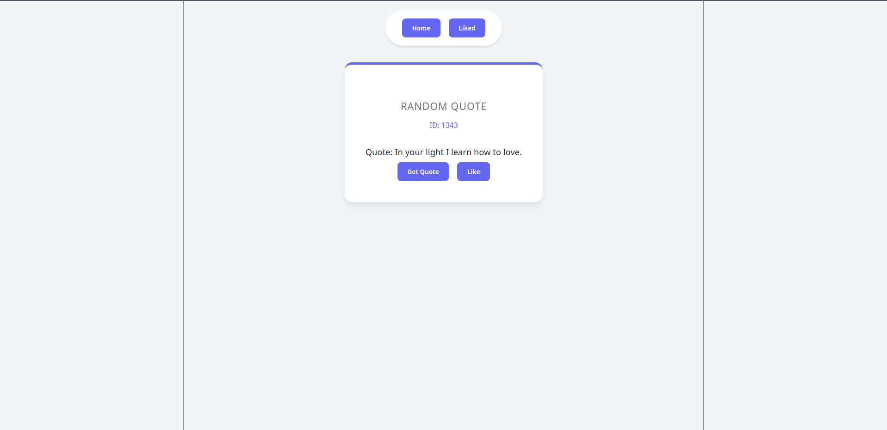

# 💡 React-Router-QuoteGen

A modern, responsive Random Quote Generator built with **React** and **React Router 6.4+**. This project was developed as a technical checkpoint for the PW Skills Web Development program, focused on mastering asynchronous data patterns.

 

## 🚀 Features

- **Instant Inspiration:** Fetches high-quality random quotes from the DummyJSON API.
- **Modern Data Fetching:** Utilizes React Router `loaders` to resolve data before component mounting.
- **Seamless UX:** Implemented `useRevalidator` for refreshing quotes without a full page reload, including a "Loading" state for better feedback.
- **Persistence:** Save your favorite quotes to `localStorage` so they stay with you even after closing the browser.
- **Mobile First:** Fully responsive design, optimized for both desktop and handheld devices.

## 🛠️ Tech Stack

- **UI Library:** React 19
- **Routing:** React Router Dom (Data APIs: Loaders, Outlets, Revalidators)
- **Styling:** Custom CSS (Flexbox & Grid)
- **API:** [DummyJSON Quotes](https://dummyjson.com/docs/quotes)

## 📦 Installation & Setup

1. **Clone the repo:**
   ```bash
   git clone [https://github.com/MATRUNI/React-Router-QuoteGen.git](https://github.com/MATRUNI/React-Router-QuoteGen.git)
2. **Install Dependencies:**
   ```bash
   npm install
3. **Run the development server:**
   ```bash
   npm run dev